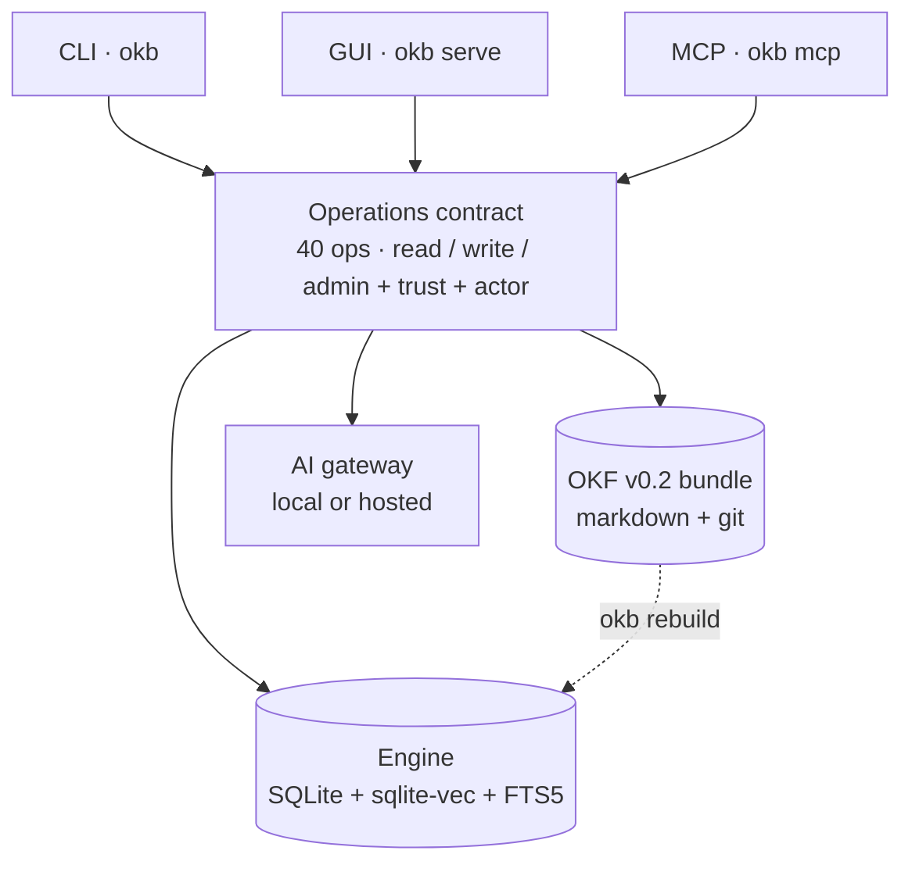

# okbrain

[](https://github.com/mellow-mike/okbrain/actions/workflows/ci.yml)
[](.github/workflows/ci.yml)
[](LICENSE)

A self-hosted personal knowledge manager whose entire database is plain markdown in git.

Your notes are a conformant [Open Knowledge Format](https://github.com/GoogleCloudPlatform/open-knowledge-format)
(OKF v0.2) bundle — one markdown file per idea, YAML frontmatter, links between
them. Search, vectors, and the graph are a **derived cache** that rebuilds from
those files with one command. Delete okbrain tomorrow and your knowledge is
still there, readable by any editor you like.

> [!NOTE]
> Pre-1.0 and not yet published to a package registry, so installing means a
> one-command build from source (or `bun run package` for an offline archive).
> Stages 0–6 of the [roadmap](ROADMAP.md) are complete: CLI, local web GUI,
> and MCP server all work today, with 437 tests green on macOS, Linux,
> and Windows.

## Why

Most knowledge tools own your data in a proprietary store and rent you access
to it. okbrain inverts that: the markdown *is* the database.

- **No lock-in, provable.** `okb rebuild` deletes the index and reconstructs it
  from the markdown. Anything the database knows, the files already said.
- **Provenance, trust, and lifecycle are first-class.** Every write records
  who changed it (`generated`), reviews become `verified` events with derived
  trust tiers (unverified → machine-confirmed → human-reviewed), concepts carry
  a `status` and a `stale_after` date, and clips, feeds, and the enrichment
  agent cite their `sources` in frontmatter — all of it OKF v0.2, readable by
  any other OKF tool. `okb upgrade` migrates older bundles.
- **Runs fully offline.** Six runtime dependencies, one compiled binary, no
  Docker, no daemon, no mandatory network. AI is opt-in and never implicit — no
  command spends tokens unless you asked it to.
- **One contract, three surfaces.** 40 operations defined once drive the CLI
  (`okb`), a local web app (`okb serve`), and an MCP server (`okb mcp`) so your
  own agents can query your brain as a tool. Every capability is reachable
  from all three.
- **Hybrid retrieval.** Keyword (FTS5/BM25) + semantic vectors (sqlite-vec) +
  graph expansion + typed-edge relational recall, fused into one ranking.
  `okb ask` answers with citations post-verified against your actual notes.
- **Fail-closed trust.** MCP exposes 15 read-only tools by default and 31 only
  when you pass `--trusted`; its writes are attributed to the client, never to
  you; brains can be mounted read-only.

Not for you if you want mobile apps, hosted sync, WYSIWYG editing, or
multi-user collaboration. This is a single-user tool for a laptop.

## See it work

Write a note:

```bash
okb new note "Spaced repetition" "Reviewing material at increasing intervals" \
  --tags pkm,method \
  --body 'Retrieval effort is what strengthens memory — see [Zettelkasten](zettelkasten.md).'
```

```text
created notes/spaced-repetition
```

A real file you can open in any editor — frontmatter scaffolded, the change
attributed to you, the relative link rewritten to bundle-absolute, `index.md`
and `log.md` updated alongside:

```markdown
---
type: note
title: Spaced repetition
description: Reviewing material at increasing intervals
tags:
  - pkm
  - method
generated:
  by: human:you
  at: 2026-09-03T12:53:02Z
---
Retrieval effort is what strengthens memory — see [Zettelkasten](/notes/zettelkasten.md).
```

Then index and search it:

```bash
okb index
okb search "atomic notes"
```

```text
indexed 5, skipped 0, removed 0, edges 8

0.016  notes/zettelkasten — Zettelkasten  [keyword]
0.004  notes/evergreen-notes — Evergreen notes  [graph]
0.004  notes/spaced-repetition — Spaced repetition  [graph]
0.004  projects/okbrain — okbrain  [graph]
0.004  references/open-knowledge-format — Open Knowledge Format  [graph]
```

The bracketed tag is the retrieval arm that surfaced each hit — the new note
never mentions "atomic notes", but the link it just made to Zettelkasten pulled
it in. Run `okb embed` and `[vector]` joins the mix. Every command takes
`--json`.

## Install

Requires [Bun](https://bun.sh) ≥ 1.1. Build the binary:

```bash
git clone https://github.com/mellow-mike/okbrain && cd okbrain
bun install
bun run build
```

That produces `bin/okb` plus the `sqlite-vec` extension beside it. Keep the two
together — `okb` looks for `vec0.{so,dylib,dll}` next to its own executable —
then put the directory on your `PATH` and check it works:

```bash
export PATH="$PWD/bin:$PATH"
okb --version
```

For a self-contained, fully offline package of this machine's build, run
`bun run package`: it writes `dist/okb-<version>-<os>-<arch>.tar.gz` (or
`.zip` on Windows) holding the binary, the extension, README and LICENSE —
the CLI, the local API, the embedded GUI, and the MCP server, with nothing
downloaded at runtime. Unpack it anywhere and put the directory on `PATH`.

<details>
<summary>macOS: enabling vector search</summary>

`bun:sqlite` links Apple's system SQLite, which cannot load extensions. Install
an extension-capable build once and okbrain finds it automatically:

```bash
brew install sqlite
```

Or point `$OKB_SQLITE_LIB` at any real `libsqlite3.dylib`. Everything except
vector search works without this.

</details>

<details>
<summary>Prebuilt binaries and package managers</summary>

<!-- TODO: no release tagged yet (version 0.1.0, zero GitHub releases).
     Revisit once the first tag ships. -->

No release has been tagged yet. Tagging `vX.Y.Z` triggers
[`release.yml`](.github/workflows/release.yml), which cross-compiles five
targets (linux-x64/arm64, darwin-x64/arm64, windows-x64), pairs each with its
platform's `vec0`, and publishes archives plus `SHA256SUMS.txt` to GitHub
Releases — the same archive layout `bun run package` builds locally. Homebrew
and Scoop manifest templates for running your own tap or bucket live in
[`packaging/`](packaging/); artifacts are unsigned.

</details>

## Quick start

Try it against the example bundle that ships with the repo, without touching
your own notes:

```bash
okb --bundle bundles/example index
okb --bundle bundles/example stats
```

```text
4 concepts, 7 links (0 typed), 4 tags
by type:  note 2, project 1, reference 1
top tags: pkm 2, format 1, method 1, software 1
orphans 0, inbox 0, never reviewed 4, stale 0 (>180d), past stale_after 0
status:   draft 0, stable 4, deprecated 0
trust:    unverified 4, machine-confirmed 0, human-reviewed 0
freshest 2026-07-05, oldest 2026-07-05
```

`bundles/acme_retail` is the OKF project's own v0.2 showcase (metrics,
policies, an attested computation), vendored as a read-only conformance
fixture — `okb --bundle bundles/acme_retail doctor` shows the trust and
lifecycle signals on a bundle okbrain did not write.

Then start your own brain. It's just a directory:

```bash
mkdir ~/brain && cd ~/brain
okb init --actor human:you                  # persists this bundle as the default
okb capture "An idea I had on the train"    # → inbox/, zero friction
okb import ~/old-notes                      # map existing markdown into concepts
okb index && okb search "train"
```

`okb init` is non-interactive: with an API key exported (`ANTHROPIC_API_KEY`,
`OPENAI_API_KEY`, …) it selects that provider, with none it configures a local
model. Keys are read from the environment only, never written to disk. The
**actor** is the identity stamped on everything you write (`generated.by`,
`verified.by`); it defaults to `human:<os user>`.

## Commands

`okb help` lists everything; `okb help <command>` shows one command's options.
Global flags: `--json`, `--bundle <path>`, `--brain <name>`, `--version`.

| Area | Commands |
|---|---|
| author | `new` · `capture` · `import` · `write` · `rm` |
| ingest | `clip` · `rss` · `enrich` · `inbox` · `inbox read` |
| retrieve | `search` · `ask` · `read` · `list` |
| graph | `graph` · `path` · `orphans` · `graph-data` · `export-viz` · `links suggest` · `links accept` |
| review | `review` · `review done` · `review snooze` |
| claims | `take` · `resolve` · `calibrate` |
| maintain | `index` · `rebuild` · `embed` · `doctor` · `upgrade` · `stats` · `jobs` · `sync` |
| serve | `serve` · `bookmarklet` · `mcp` |
| setup | `init` · `brains` · `version` |

### Provenance and trust

```bash
okb read notes/spaced-repetition --json      # frontmatter + body + derived signals (status, trust, stale)
okb list --detail --status draft             # every concept with its signals; filter by type/tag/status
okb write notes/x --status deprecated        # lifecycle: draft | stable | deprecated
okb write notes/x --stale-after 2026-12-31T00:00:00Z --sources https://…,/notes/y.md
okb review done 1                            # records `verified: [{ by: human:you, at: … }]`
okb doctor                                   # conformance + trust/lifecycle summary; flags v0.1 leftovers
okb upgrade --dry-run && okb upgrade         # timestamp → generated, # Citations → sources, …
```

Clips and feed items record the page under `sources` (with byline and
publication date as credibility signals); the enrichment agent must cite its
pages the same way and is stamped `okb-enrich/<model>`. Provenance entries
that point at other concepts become `cites` edges in the graph.

### Asking questions

```bash
okb embed                                        # incremental; resumes if interrupted
okb ask "what did I conclude about spaced repetition?"
```

`ask` retrieves across every arm, packs the best concepts into a prompt, and
verifies each citation against your bundle before printing it — a concept id
the model invented is never shown as a source. `--profile lean|balanced|max`
trades recall against cost (`lean` keeps a local model comfortable).

### The other two surfaces

```bash
okb serve --open         # web app on http://127.0.0.1:6522, loopback only
okb bookmarklet          # a clip-this-page bookmarklet for your browser
okb mcp                  # stdio MCP, 15 read-only tools
okb mcp --trusted        # 31 tools including writes — only for clients you trust
```

The GUI is a full surface over the same operations: a Home page (brain at a
glance, quick capture, today's review queue, inbox, recent changes, one-click
conformance check), Browse (every concept with status, trust tier, staleness),
a Concept reader (provenance, footnote attribution, links to / cited by,
verify / deprecate / delete), an editor with the v0.2 fields and a sources
editor, the live graph, search, ask, review, inbox, add (capture, clip, feeds,
import, the bookmarklet), claims, stats, and settings (your actor, providers,
sync, enrichment, maintenance including jobs and the v0.2 upgrade, MCP setup,
a brain switcher). Every request is token-gated, and rendered markdown never
executes HTML from a clipped page. MCP tool schemas are generated from the
same contract as the CLI; writes made over MCP are attributed to the connected
client, and admin operations (`rebuild`, `init`, `serve`) never appear there.
`okb mcp --http` serves Streamable HTTP on port 6523.

### Sync and maintenance

```bash
okb sync                 # git init + commit, and pull/push when origin is set
okb review               # today's "worth another look" queue, with reasons
okb jobs                 # one pass: index, embed, rss, review, doctor
```

Multi-device sync **is** git — add an `origin` remote, and the other machine
runs `okb index` after cloning. Directories named `db_only/` stay on disk and
in the index but out of git. The review queue ranks concepts past their
`stale_after` first, nudges drafts, and never queues deprecated ones.

Schedule `okb jobs` with cron, launchd, or Task Scheduler; there is no daemon,
and its embed step skips itself until you have run `okb embed` once, so a
nightly run can't start spending on a hosted provider behind your back.
Deliberate AI enrichment is its own command — `okb enrich` turns an LLM loose
on the web inside hard caps on depth, hosts, paths, and pages, every one of
them enforced in the tool rather than the prompt.

## Configuration

`config.json` lives in your per-user config directory — `~/.config/okbrain` on
Linux and macOS, `%APPDATA%\okbrain` on Windows. `okb init` writes it and it's
safe to hand-edit; unknown keys survive rewrites.

| Key | What it controls |
|---|---|
| `defaultBundle` | Bundle used when neither `--bundle` nor `$OKB_BUNDLE` is set |
| `actor` | Who your writes are attributed to (`human:<id>`); default `human:<os user>` |
| `ai.*` | Chat / embed / rerank provider, model, and base URL |
| `retrieval.profile` | Default retrieval profile: `lean`, `balanced`, or `max` |
| `review.*` | Queue size, cooldown days, scoring weights (incl. `expired`, `draft`) |
| `clip.*` | Body size cap, default tags, stripped query params, auto-tagging |
| `rss.feeds` | Feeds pulled by `okb rss` with no URL, and by `okb jobs` |
| `serve.open` | Open the browser when `okb serve` starts |
| `brains` | Named bundle mounts and their read-only policy |

`brains` is how you run more than one: name each bundle, then address it with
`--brain work`, `$OKB_BRAIN`, or the GUI's sidebar switcher. A mount marked
`readonly` refuses every write and admin operation on all three surfaces
alike.

Environment variables override the config file, and flags override both:

| Variable | Purpose |
|---|---|
| `OKB_BUNDLE`, `OKB_BRAIN` | Active bundle or named mount |
| `OKB_AI_PROVIDER` | Provider for every capability it supports |
| `OKB_{CHAT,EMBED,RERANK}_{PROVIDER,MODEL,BASE_URL}` | Per-capability overrides |
| `OKB_SQLITE_VEC`, `OKB_SQLITE_LIB` | Explicit `vec0` / SQLite library paths |
| `OKB_LOG_LEVEL`, `OKB_LOG_JSON` | Logging verbosity and format |
| `{ANTHROPIC,OPENAI,GEMINI,OPENROUTER,VOYAGE}_API_KEY` | Hosted-provider keys; local models need none |

### Exit codes

| Code | Meaning |
|---|---|
| `0` | Success |
| `1` | Runtime failure — missing bundle, engine or AI error, `doctor` found problems, a job failed |
| `2` | Usage error — unknown flag, missing or invalid argument |

`okb doctor` returning `1` on conformance findings makes it usable as a CI gate
over your notes.

## How it works



Surfaces only call operations; operations read and write the bundle and refresh
the engine; the engine is always reconstructible from the bundle. The engine
sits behind an interface, so Postgres can drop in later without canonical state
ever living behind it.

## Documentation

| Doc | What it covers |
|---|---|
| [CONTEXT.md](CONTEXT.md) | Living design reference — how each component works and why |
| [ROADMAP.md](ROADMAP.md) | Granular tasks, bug log, backlog, progress log |
| [CLAUDE.md](CLAUDE.md) | North Star, invariants, and working rules |
| [skills/](skills/) | Agent skills: capture, ingest, enrich, query, daily-note, link-suggest |
| [bundles/](bundles/README.md) | The example bundle and the vendored OKF v0.2 sample |
| [packaging/](packaging/) | Release flow, offline packaging, Homebrew and Scoop manifests, signing notes |

## Development

```bash
bun install
bun run okb <args>     # run the CLI from source
bun run typecheck      # tsc --noEmit, strict
bun test               # 437 tests, no network
bun run build          # bin/okb + vec0 beside it
bun run package        # offline release archive for this machine → dist/
```

CI runs typecheck and tests on macOS, Linux, and Windows with a pinned Bun; a
change isn't done until it's green on all three. Contributions are welcome —
open an issue before a large change, and read [CLAUDE.md](CLAUDE.md) first for
the invariants a patch has to hold. Every bug fix lands with a test that fails
before and passes after, and behavior changes update `CONTEXT.md` and
`ROADMAP.md` in the same commit.

## License

[MIT](LICENSE) © mellow-mike. `bundles/acme_retail/` is Apache-2.0 (upstream
OKF sample).
